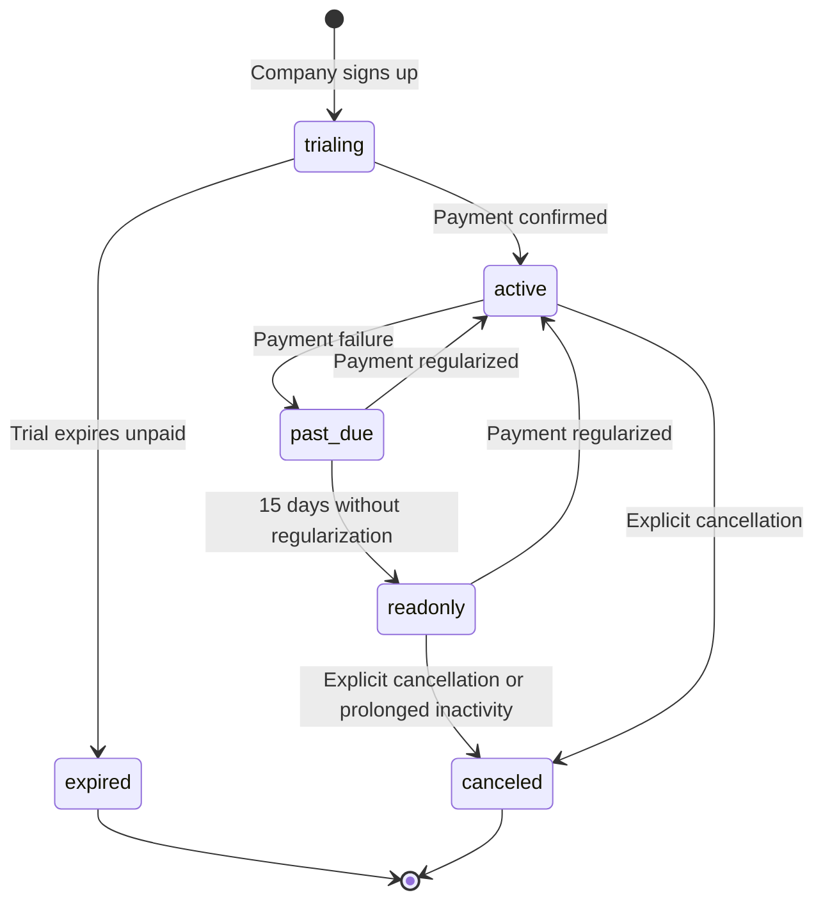

# NEXTIME --- PRICING STRATEGY

Version: 1.1 Status: Planned (no billing/plan enforcement is implemented yet — see [../02-architecture/DATABASE_ARCHITECTURE.md](../02-architecture/DATABASE_ARCHITECTURE.md), no `subscriptions`/`plans` table exists in the current schema) Last Updated: 2026-07-21

# Purpose

This document replaces an earlier, unrelated draft plan structure (Free/Starter/Pro/Business/Enterprise) with the deliberately-designed model from `Documentacao Projeto NEXTIME/NEXTIME_MASTER_DOCUMENTATION_7.md` (chapter 4), which is the one product decisions should follow. **Nothing described here is implemented in the database or application yet.**

------------------------------------------------------------------------

# Billing unit

The billing unit is always the **Company** (tenant). There is never direct billing to an individual Workforce Member outside a Company's context. Each Company holds exactly one active Subscription, tied to one Plan (tier).

------------------------------------------------------------------------

# Plan tiers (target design)

| Plan | Included Workforce Members | Concurrent Projects | Historical report retention | Automated billing | External integrations |
| --- | --- | --- | --- | --- | --- |
| Starter | up to 15 | up to 5 | 6 months | No (manual export) | No |
| Growth | up to 75 | up to 30 | 24 months | Yes | Limited (1 active) |
| Scale | up to 300 | Unlimited | Unlimited | Yes | Unlimited |
| Enterprise (by quote) | Custom | Unlimited | Unlimited | Yes + custom approval rules | Unlimited + corporate SSO |

Enterprise exists only as a commercial escape valve for one-off negotiations — it must not drive core architecture decisions.

------------------------------------------------------------------------

# Pricing formula (target design)

```
Invoice amount = Plan base price
                + (Active Workforce Members above the plan's included count × Overage price per member)
                + Contracted add-ons (e.g. extra integrations on the Growth plan)
```

An **active Workforce Member** is one with at least one approved or pending Time Entry in the current billing cycle, OR one explicitly marked "active" by the Company admin even without entries (e.g. a new hire in onboarding). The billing cycle is monthly, with a cutoff fixed to the Company's original subscription date.

------------------------------------------------------------------------

# Plan-change rules (target design)

- **Upgrade:** immediate prorated charge for the base-price difference, calculated on the remaining days in the current cycle; new limits apply immediately.
- **Downgrade:** no prorated refund — takes effect only at the next billing cycle, to prevent a Company reducing its plan at cycle-end to avoid paying for a month already consumed at the higher tier.
- **Adding a member above the plan limit:** prorated charge from the date the member became active, not the invoice date.
- **Removing/deactivating a member:** no prorated refund within the current cycle — the cost reduction only applies next cycle, to prevent activate/deactivate abuse.

------------------------------------------------------------------------

# Subscription lifecycle (target design)



A Company in `past_due` for more than 15 days enters **read-only mode**: users can view historical data and export reports but cannot create new Time Entries, Projects, or Teams — this preserves customer data without allowing unpaid use.

------------------------------------------------------------------------

# Common mistakes to avoid when this is implemented

- Calculating "active Workforce Member" from login activity alone — the rule above is based on Time Entry activity or an explicit active flag, not login.
- Applying a "goodwill" prorated refund outside the rules above without recording it as a deliberate commercial decision.
- Fully blocking Company access the moment a Subscription becomes `past_due` — the grace period before read-only mode is part of the design, not an afterthought.

------------------------------------------------------------------------

# Goal

Keep pricing logic as a direct, traceable projection of approved Time Entry data (see [PRODUCT_VISION.md](PRODUCT_VISION.md)) — not a parallel system that can drift from what was actually worked and approved.
