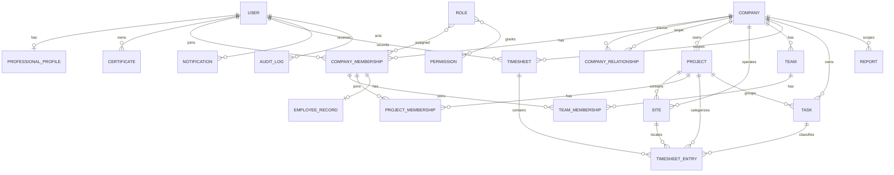

# NEXTIME --- DATABASE ARCHITECTURE

Version: 1.1 Status: Completed (foundation, Sprint 3.5.2–3.9.1) Last Updated: 2026-07-21

# Purpose

This document defines the actual database architecture implemented for NEXTIME: the real schema in `supabase/migrations/`, not a generic template.

------------------------------------------------------------------------

# Technology

- Supabase-managed PostgreSQL, applied through the Supabase CLI (`supabase/migrations/*.sql`, `supabase/config.toml`).
- Row Level Security (RLS) enabled on every tenant-owned table.
- `supabase/seed.sql` provides development-only data (two demo companies, one relationship, one project/site, role and permission catalogs) — never run against production.

------------------------------------------------------------------------

# Multi-Tenancy — Company is the tenant

There is no separate "Tenant" table. **`Company` is the tenant boundary.** See [MULTITENANCY.md](MULTITENANCY.md) for the full model; every tenant-owned table below carries an explicit `company_id`, indexed and RLS-protected.

------------------------------------------------------------------------

# Implemented domains and tables

| Domain | Tables |
| --- | --- |
| Identity | `users` (app profile, FK to `auth.users`), `professional_profiles`, `certificates` |
| Companies & tenancy | `companies`, `company_relationships`, `company_settings`, `company_memberships`, `membership_roles`, `roles`, `permissions`, `role_permissions` |
| Workforce | `employee_records` (deliberately excludes salary/tax/bank/medical data), `teams`, `team_memberships` |
| Operations | `projects` (with `priority`, `budget_amount`/`budget_spent`/`budget_currency` since Sprint 5.7), `project_memberships` (per-project team assignment, Sprint 5.7), `sites` (renamed from `chantiers` — any physical work location: construction site, client building, security post, distribution center, hotel property, etc.), `tasks`, `timesheets`, `timesheet_entries` |
| Reporting & system | `reports`, `notifications`, `audit_logs`, `localization_settings`, `user_settings` |

Identity is split between Supabase `auth.users` and the application-owned `public.users` — a user is never owned by a company directly, only through `company_memberships`. Roles and permissions use join tables (`role_permissions`, `membership_roles`) so authorization stays data-driven rather than hardcoded.

### Entity relationships

As of Sprint 5.3 (`202607210004_time_tracking_tasks_and_entry_status.sql`), `tasks` (company- and optionally project-scoped) and a per-entry `status` column (reusing the `timesheet_status` enum) exist on `timesheet_entries`, alongside the pre-existing timesheet-level status. Schema only — no application code reads/writes these yet; that is Sprint 5.4. See the Sprint 5 mock-data migration plan in [../05-sprints/](../05-sprints/).

------------------------------------------------------------------------

# Naming conventions

- Tables: `plural_snake_case`. Columns: `snake_case`. Primary keys: `id` (UUID, `gen_random_uuid()`). Foreign keys: `*_id`. Timestamps: `created_at`, `updated_at`.

------------------------------------------------------------------------

# Security

- RLS enabled on every tenant table; policies use `private.is_company_member(company_id)` and `private.has_company_role(company_id, roles[])`.
- Security-definer RPCs (`public.create_company`, `public.create_team`, `public.update_team`) re-validate the actor and roles inside the transaction rather than trusting the caller.
- Authorization is always re-validated server-side; RLS is the final boundary, application checks complement it but never replace it.

------------------------------------------------------------------------

# Migrations

Each migration in this project so far has one objective, is additive/idempotent where possible (`add column if not exists`), and is tied to a specific Sprint. Full clean-database migration validation (drop, reapply from scratch) is still **not** executed — Sprint 3.9.1 documents this as blocked (Docker/Supabase CLI unavailable in that session). However, migration `202607210001` (the Chantier→Site rename) **was** applied and verified against the running local database (`npx supabase migration up`, followed by `\d` inspection confirming the renamed table, indexes, all four foreign keys, all three RLS policies, the new `reference` column, and that existing seed data survived intact) — the first real (non-static-only) migration validation for this project.

**Important lesson from `202607210002` (`teams_workforce_read_grants`):** RLS policies alone are not sufficient — Postgres also requires a base `GRANT` before `authenticated` can reach a table at all through PostgREST, and this project's original migrations only added that grant for the tables needed by session/auth (`202607200001_session_read_grants.sql`), silently leaving `employee_records`, `teams`, `team_memberships`, and every table added afterwards (`projects`, `sites`, `timesheets`, `timesheet_entries`, `reports`, `notifications`, `audit_logs`, `certificates`, `company_relationships`, `company_settings`, `localization_settings`, `permissions`, `professional_profiles`, `role_permissions`, `user_settings`) with **no grant at all** for `authenticated`. This was undetectable by `npx tsc`/lint/build and only surfaced by exercising a real authenticated request in a browser. Any Sprint wiring a new table to real data must check `has_table_privilege('authenticated', '<table>', 'SELECT')` (or the equivalent grant) before assuming an RLS policy alone is enough.

A second, independent bug was found and fixed at the same time: PostgREST embeds referencing `company_memberships → users` or `company_memberships → employee_records` are ambiguous, because each of those tables has more than one foreign key to the other (`company_memberships.user_id` vs. `company_memberships.invited_by`; `employee_records.company_membership_id` vs. `employee_records.manager_membership_id`). Any `.select()` embedding `users(...)` or `employee_records(...)` from `company_memberships` must disambiguate with `!<constraint_name>` (e.g. `users!company_memberships_user_id_fkey(...)`), or PostgREST returns `PGRST201` instead of data.

**RLS gap found in Sprint 5.8 (Projects/Clients):** `companies_read_member` only allows reading a company row if the caller is a member of it. `projects.client_company_id` legitimately points to a company the caller is *not* a member of (a client, related only via `company_relationships`) — so a project's client is silently unreadable under RLS even though the relationship is a real, modeled business connection. This was not patched with a broader RLS policy (a security-policy change deserves its own deliberate decision, not a silent fix inside a data-wiring Sprint); instead, `src/features/projects/data.ts` synthesizes a placeholder client ("Client information unavailable") so the project itself is never silently dropped from a list. Follow-up needed: either a `company_relationships`-aware read policy on `companies`, or a security-definer RPC that returns minimal client info (name/contact) without granting full company read access.

------------------------------------------------------------------------

# Known extensibility gaps (Belgium-first, multi-country/multi-segment readiness audit, 2026-07-21)

A product-vision review asked whether the schema is ready for Belgian-market needs (BCE/KBO number, VAT, multi-language, flexible employee data, generic worksite, evolvable hour types, audit/GDPR) without hardcoding any one country or segment. Findings — nothing below is implemented, this is the registered follow-up list:

- **Already covered, no action needed:** `companies.registration_number` and `companies.vat_number` already exist as plain, unvalidated `text` (no Belgian-specific format check) — ready for BCE/KBO or any country's equivalent. `companies.default_language`/`timezone`/`country_code`, `employee_records.weekly_hours` (contractual hours), and `sites.reference` (free-text site reference) all already exist. Nothing in the domain hardcodes construction or Belgian law.
- **Small adaptation — add `metadata jsonb not null default '{}'` to `employee_records`:** lets country/sector-specific employee fields be added without a schema migration each time, matching the existing `audit_logs.metadata` / `companies.social_links` JSONB convention. Not yet added.
- **Small adaptation — RLS policies missing on 4 tables:** `certificates`, `company_relationships`, `localization_settings`, `professional_profiles` have RLS enabled and (as of the 202607210003 grants migration) a `SELECT` grant, but **zero policies** — they deny all access by default until someone designs who should read/write them. `localization_settings` matters most here since it's the multi-language data model; it already has the right shape (language/timezone/locale/date_format/currency, scoped to company or user) but nobody can use it yet.
- **Structural — no hour-type dimension on `timesheet_entries`:** regular/overtime/night/Sunday/holiday/travel-time/break distinctions do not exist as data today, only as a UI-only type (`lib/types/timesheet.ts EntryCategory`) never persisted. Recommended shape when prioritized: an `entry_type` enum column, additive, with no calculation logic attached until a Sprint actually implements the rules.
- **Not architecture — no i18n framework wired into the app.** The data model (`localization_settings`) is ready for per-company/per-user language; the actual UI translation layer (e.g. `next-intl`) is not installed. This is application work, not a schema gap.

------------------------------------------------------------------------

# Goal

Keep the schema the single source of truth for tenant isolation and domain shape, with every new tenant-owned table following the same `company_id` + RLS + policy convention already established.
