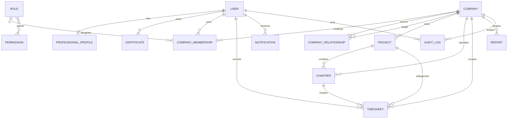

# NEXTIME Domain Architecture

## Purpose

`src/domain` is the framework-independent core of NEXTIME. It contains domain contracts only: no React, Next.js, persistence, Supabase, or presentation concerns. Application services and adapters can consume the public barrel at `src/domain/index.ts` without coupling business concepts to infrastructure.

## Core ownership model

A **User** belongs to NEXTIME, never directly to a company. A **CompanyMembership** links a user to a company for a defined period and carries roles plus explicit permission overrides. This supports multiple concurrent companies, company switching, and professional history without duplicating identity.

**ProfessionalProfile** extends the global identity with specialties, experience, certificates, languages, portfolio, availability, résumé, and public links. A **Certificate** belongs to the user and may be referenced by the profile.

A **Company** is an independent organization with its own identity, localization defaults, currency, address, status, and settings. **CompanyRelationship** connects two companies as client, contractor, subcontractor, or partner, providing the foundation for NEXTIME Connect and the Contractor Network.

## Operational model

- **Project** is owned by a company and can reference a client company, manager, schedule, cost center, and estimated effort.
- **Chantier** represents a physical worksite. It connects the operating company and client, with address, GPS, purchase order, cost center, manager, dates, and lifecycle status. A chantier may belong to a project.
- **Timesheet** is tenant-scoped by company and records one user's period. Its entries can reference projects and chantiers. Submission and review fields prepare the approval workflow.
- **Report** records an asynchronous, company-scoped export request and keeps parameters infrastructure-neutral for future finance, accounting, and AI reporting.

## Governance and communication

**Role** groups permission identifiers. **Permission** defines resource, action, optional scope, and allow/deny effect; named job profiles are data, not hardcoded authorization rules. Memberships hold role assignments and overrides. Enforcement belongs in application policies and Supabase RLS adapters.

**Notification** supports INFO, WARNING, ACTION_REQUIRED, and SUCCESS messages. Per-user **NotificationPreference** separates in-app, email, and push delivery choices.

**AuditLog** captures actor, time, tenant, action, target, and structured metadata. It is append-oriented and designed for important actions across membership, time, projects, reports, finance, and settings.

## Localization and settings

**LocalizationSettings** supports language, locale, timezone, date format, and currency at user or company scope. **CompanySettings** owns organization-wide time, localization, notifications, and accounting defaults. **UserSettings** owns personal display preferences, notification choices, and default company context.

## Entity relationships

## Dependency direction

Domain contracts have no outward dependencies. Future application use cases may depend on this domain; infrastructure adapters may implement repositories and policies for Supabase; UI may consume application view models. The domain must never import those layers.
